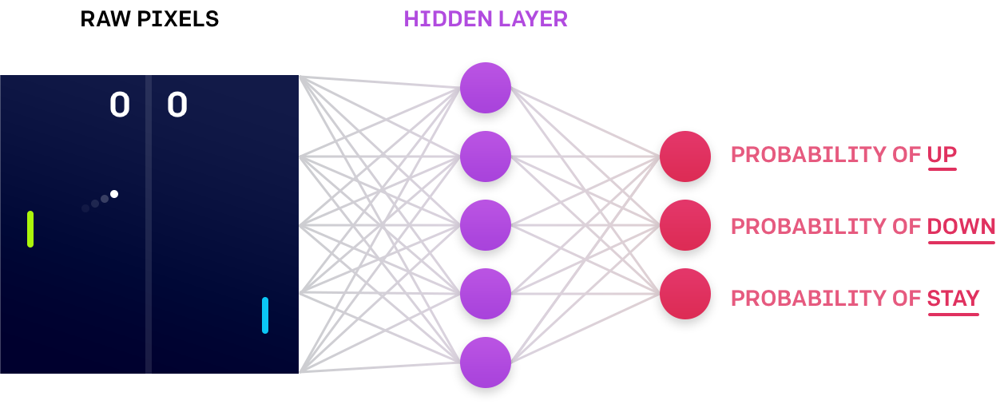
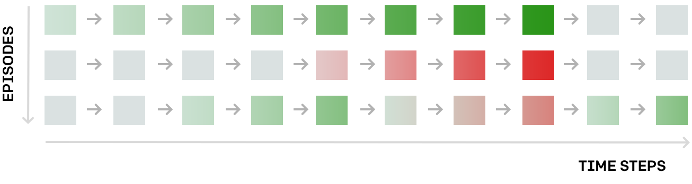
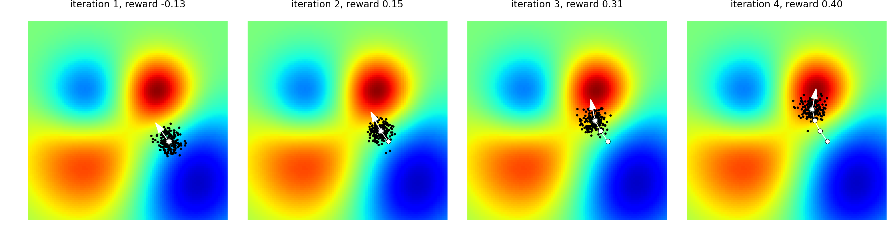
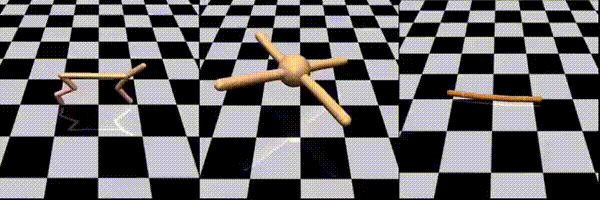
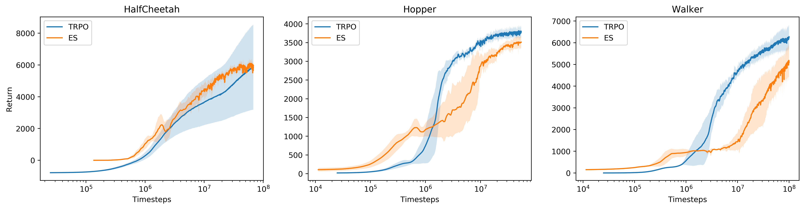
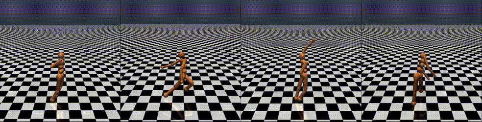

## Evolution Strategies as a Scalable Alternative to Reinforcement Learning


***
*我们已经发现，进化策略（ES）是一种已知数十年的优化技术，可与现代RL基准测试（例如Atari / MuJoCo）上的标准强化学习（RL）技术的性能相媲美，同时克服了RL的许多不便之处。*

*We've [discovered](https://arxiv.org/abs/1703.03864) that  [evolution strategies (ES)](https://arxiv.org/abs/1703.03864), an optimization technique that's been known for decades, rivals the performance of standard **reinforcement learning (RL)** techniques on modern RL benchmarks (e.g. Atari/MuJoCo), while overcoming many of RL's inconveniences.*


*特别是，ES实现起来更简单（不需要反向传播），在分布式场景中更容易扩展，在稀疏奖励的场景中不会受到影响，并且具有更少的超参数。 这个结果令人惊讶，因为ES类似于高维空间中的简单爬山，仅基于每个步骤沿着几个随机方向的有限差异。*


*In particular, ES is simpler to implement (there is no need for [backpropagation](http://neuralnetworksanddeeplearning.com/chap2.html)), it is easier to scale in a distributed setting, it does not suffer in settings with sparse rewards, and has fewer [hyperparameters](https://www.quora.com/What-are-hyperparameters-in-machine-learning). This outcome is surprising because ES resembles simple hill-climbing in a high-dimensional space based only on [finite differences](https://en.wikipedia.org/wiki/Finite_difference) along a few random directions at each step.*


[View on GitHub](https://github.com/openai/evolution-strategies-starter)

[View on arXiv](https://arxiv.org/abs/1703.03864)
***

我们的发现延续了几十年前的想法取得强劲成果的现代趋势。例如，在2012年，“AlexNet”论文展示了如何设计，扩展和训练卷积神经网络（CNN），以在图像识别任务上获得极其强大的结果，当时大多数研究人员认为CNN不是一种很有前景的方法。计算机视觉。同样，在2013年，深度Q学习论文展示了如何将Q-Learning与CNN结合起来成功解决Atari游戏，将RL重新作为研究领域重新激发实验（而非理论）结果。同样，我们的工作表明ES在RL基准测试中取得了很好的表现，消除了ES方法无法应用于高维问题的普遍看法。
>Our finding continues the modern trend of achieving strong results with decades-old ideas. For example, in 2012, the [“AlexNet” paper](https://papers.nips.cc/paper/4824-imagenet-classification-with-deep-convolutional-neural-networks) showed how to design, scale and train convolutional neural networks (CNNs) to achieve extremely strong results on image recognition tasks, at a time when most researchers thought that CNNs were not a promising approach to computer vision. Similarly, in 2013, the [Deep Q-Learning paper](https://arxiv.org/abs/1312.5602) showed how to combine Q-Learning with CNNs to successfully solve Atari games, reinvigorating RL as a research field with exciting experimental (rather than theoretical) results. Likewise, our work demonstrates that ES achieves strong performance on RL benchmarks, dispelling the common belief that ES methods are impossible to apply to high dimensional problems.

ES易于实施和扩展。在80台机器和1,440个CPU核心的计算集群上运行，我们的实施能够在10分钟内训练3D MuJoCo人形步行器（32个核上的A3C大约需要10小时）。使用720个核，我们还可以在Atari上获得与A3C相当的性能，同时将训练时间从1天减少到1小时。
>ES is easy to implement and scale. Running on a computing cluster of 80 machines and 1,440 CPU cores, our implementation is able to train a 3D MuJoCo humanoid walker in only 10 minutes (A3C on 32 cores takes about 10 hours). Using 720 cores we can also obtain comparable performance to A3C on Atari while cutting down the training time from 1 day to 1 hour.

在下文中，我们将首先简要描述传统的RL方法，与我们的ES方法形成对比，讨论ES和RL之间的权衡，最后重点介绍我们的一些实验。
>In what follows, we’ll first briefly describe the conventional RL approach, contrast that with our ES approach, discuss the tradeoffs between ES and RL, and finally highlight some of our experiments.


## Reinforcement Learning
让我们简要介绍一下RL的工作原理。假设我们有一些我们想要训练智能体的环境（例如游戏）。为了描述智能体的行为，我们定义了一个策略函数（智能体的大脑），它计算智能体在任何给定情况下应该如何行动。在实践中，策略通常是神经网络，其将游戏的当前状态作为输入并计算采取任何允许的动作的概率。典型的策略函数可能具有大约1,000,000个参数，因此我们的任务归结为找到这些参数的精确设置，从而获得一个优良的运行策略（即赢得大量游戏）。
>Let’s briefly look at how RL works. Suppose we are given some environment (e.g. a game) that we’d like to train an agent on. To describe the behavior of the agent, we define a policy function (the brain of the agent), which computes how the agent should act in any given situation. In practice, the policy is usually a neural network that takes the current state of the game as an input and calculates the probability of taking any of the allowed actions. A typical policy function might have about 1,000,000 parameters, so our task comes down to finding the precise setting of these parameters such that the policy plays well (i.e. wins a lot of games).




`Above`: *In the game of Pong, the policy could take the pixels of the screen and compute the probability of moving the player's paddle (in green, on right) Up, Down, or neither.*

该策略的训练过程如下。 从随机初始化开始，我们让智能体与环境交互一段时间并收集所有游戏过程的交互（例如，每个游戏过程都是Pong的一个游戏）。 因此，我们获得了所发生事件的完整记录：我们遇到的状态序列，我们在每个状态采取的行动，以及每一步的奖励。 作为示例，下面是三个游戏过程的图表，每盘在假设环境中花费10个时间步长。 每个矩形都是一个状态，如果奖励为正（例如我们刚刚将球击过我们的对手），则矩形为绿色;如果奖励为负，则矩形为红色（例如我们错过了球）：

>The training process for the policy works as follows. Starting from a random initialization, we let the agent interact with the environment for a while and collect episodes of interaction (e.g. each episode is one game of Pong). We thus obtain a complete recording of what happened: what sequence of states we encountered, what actions we took in each state, and what the reward was at each step. As an example, below is a diagram of three episodes that each took 10 time steps in a hypothetical environment. Each rectangle is a state, and rectangles are colored green if the reward was positive (e.g. we just got the ball past our opponent) and red if the reward was negative (e.g. we missed the ball):



该图表显示了我们如何改进策略的方法：无论我们碰巧做什么导致绿色状态都很好，我们在导致红色状态所做的事情都很糟糕。然后，我们可以使用反向传播来计算网络参数的小更新，这些更新将使未来的那些状态中的导致绿色的操作更有可能，并且将来这些状态中导致红色的操作不太可能。我们期望更新的策略可以更好地运行。然后我们迭代该过程：收集另一批游戏过程，进行另一次更新等。
>This diagram suggests a recipe for how we can improve the policy; whatever we happened to do leading up to the green states was good, and whatever we happened to do in the states leading up to the red areas was bad. We can then use backpropagation to compute a small update on the network's parameters that would make the green actions more likely in those states in the future, and the red actions less likely in those states in the future. We expect that the updated policy works a bit better as a result. We then iterate the process: collect another batch of episodes, do another update, etc.

**通过在行动中注入噪声进行探索。** 我们通常在RL中使用的策略是随机的，因为它们只计算采取任何行动的概率。这样，在训练过程中，智能体可能会多次发现自己处于特定状态，并且在不同时间由于采样将采取不同的动作。这提供了学习所需的信号;其中一些行动将带来良好的结果，并得到鼓励，其中一些不会成功，并且得到惩罚。因此，我们说通过在智能体的行为中注入噪声来引入对学习过程的探索，我们通过从每个时间步长的动作分布中抽样来做到这一点。这将与我们接下来描述的ES形成对比。
> **Exploration by injecting noise in the actions.**  The policies we usually use in RL are stochastic, in that they only compute probabilities of taking any action. This way, during the course of training, the agent may find itself in a particular state many times, and at different times it will take different actions due to the sampling. This provides the signal needed for learning; some of those actions will lead to good outcomes, and get encouraged, and some of them will not work out, and get discouraged. We therefore say that we introduce exploration into the learning process by injecting noise into the agent's actions, which we do by sampling from the action distribution at each time step. This will be in contrast to ES, which we describe next.

## Evolution Strategies
>进化策略

关于“进化”。在我们深入研究ES方法之前，重要的是要注意尽管“进化”这个词，ES与生物进化关系不大。这些技术的早期版本可能受到生物进化的启发，并且该方法可以在抽象层面上被视为对一群个体进行抽样并允许成功的个体决定后代的分布。然而，数学细节是从生物进化中大量抽象出来的，最好`将ES视为一类黑盒随机优化技术`。
>**On Evolution.** Before we dive into the ES approach, it is important to note that despite the word “evolution”, ES has very little to do with biological evolution. Early versions of these techniques may have been inspired by biological evolution and the approach can, on an abstract level, be seen as sampling a population of individuals and allowing the successful individuals to dictate the distribution of future generations. However, the mathematical details are so heavily abstracted away from biological evolution that it is best to think of ES `as simply a class of black-box stochastic optimization techniques`.

**黑盒优化。** 在ES中，我们完全忘记了存在智能体，环境，涉及神经网络，或者随着时间的推移发生交互等等。整个数据集是1,000,000个数字（恰好描述了策略网络的参数）输入，1个数字输出（总奖励值），我们想要找到1,000,000个号码的最佳设置。在数学上，我们会说我们正在相对于输入向量`w`（网络的参数/权重）优化函数`f(w)`，但我们除了除了可以对其进行评估外，无法推测出`f`的结构（“黑盒”的由来）。
>**Black-box optimization.**  In ES, we forget entirely that there is an agent, an environment, that there are neural networks involved, or that interactions take place over time, etc. The whole setup is that 1,000,000 numbers (which happen to describe the parameters of the policy network) go in, 1 number comes out (the total reward), and we want to find the best setting of the 1,000,000 numbers. Mathematically, we would say that we are optimizing a function `f(w)` with respect to the input vector `w` (the parameters / weights of the network), but we make no assumptions about the structure of `f`, except that we can evaluate it (hence "black box").

**ES算法。** 直觉上，优化是一个“猜测和检查”过程，我们从一些随机参数开始，然后重复 1）有点随机的调整猜测，2）朝着那些可以更好地工作的方向轻微调整我们的猜测。具体地说，在每个步骤中，我们采用参数向量`w`并通过用高斯噪声抖动来生成例如1​​00个稍微不同的参数向量为`w1 ... w100`。然后，我们通过在环境中运行相应的策略网络一段时间来独立评估100个候选者中的每一个，并在每种情况下累加所有奖励。然后，更新的参数矢量变为100个矢量的加权和，其中每个权重与总奖励成比例（即，我们希望更成功的候选者具有更高的权重）。在数学上，你会注意到这也等同于使用有限差分估计参数空间中预期奖励的梯度，除了我们只沿100个随机方向做。另一种看待它的方式是我们仍然在做RL（Policy Gradients，或者具体是[REINFORCE](http://www-anw.cs.umass.edu/~barto/courses/cs687/williams92simple.pdf) ），其中智能体的动作是使用高斯策略产生整个参数向量。
>**The ES algorithm.** Intuitively, the optimization is a "guess and check"; process, where we start with some random parameters and then repeatedly 1) tweak the guess a bit randomly, and 2) move our guess slightly towards whatever tweaks worked better. Concretely, at each step we take a parameter vector `w` and generate a population of, say, 100 slightly different parameter vectors `w1 ... w100` by jittering `w` with gaussian noise. We then evaluate each one of the 100 candidates independently by running the corresponding policy network in the environment for a while, and add up all the rewards in each case. The updated parameter vector then becomes the weighted sum of the 100 vectors, where each weight is proportional to the total reward (i.e. we want the more successful candidates to have a higher weight). Mathematically, you'll notice that this is also equivalent to estimating the gradient of the expected reward in the parameter space using finite differences, except we only do it along 100 random directions. Yet another way to see it is that we're still doing RL (Policy Gradients, or [REINFORCE](http://www-anw.cs.umass.edu/~barto/courses/cs687/williams92simple.pdf)  specifically), where the agent's actions are to emit entire parameter vectors using a gaussian policy.



*`上图`：ES优化过程，在只有两个参数和奖励功能的设置中（红色=高，蓝色=低）。 在每次迭代中，我们显示当前参数值（白色），一组抖动样本（黑色）和估计梯度（白色箭头）。 我们继续将参数移动到箭头顶部，直到我们收敛到局部最优值。 您可以使用此[笔记](https://github.com/karpathy/randomfun/blob/master/es.ipynb)重现此图。*
>*`Above`: ES optimization process, in a setting with only two parameters and a reward function (red = high, blue = low). At each iteration we show the current parameter value (in white), a population of jittered samples (in black), and the estimated gradient (white arrow). We keep moving the parameters to the top of the arrow until we converge to a local optimum. You can reproduce this figure with [this notebook](https://github.com/karpathy/randomfun/blob/master/es.ipynb).*

**代码示例。** 为了使核心算法具体化并突出其简单性，这里有一个使用ES优化二次函数的简短示例（或者查看带有更多注释的[更长版本](https://gist.github.com/karpathy/77fbb6a8dac5395f1b73e7a89300318d)）：
>**Code sample.** To make the core algorithm concrete and to highlight its simplicity, here is a short example of optimizing a quadratic function using ES (or see this [longer version](https://gist.github.com/karpathy/77fbb6a8dac5395f1b73e7a89300318d) with more comments):


```python
# simple example: minimize a quadratic around some solution point
import numpy as np
solution = np.array([0.5, 0.1, -0.3])
def f(w): return -np.sum((w - solution)**2)

npop = 50      # population size
sigma = 0.1    # noise standard deviation
alpha = 0.001  # learning rate
w = np.random.randn(3) # initial guess
for i in range(300):
N = np.random.randn(npop, 3)
R = np.zeros(npop)
for j in range(npop):
w_try = w + sigma*N[j]
R[j] = f(w_try)
A = (R - np.mean(R)) / np.std(R)
w = w + alpha/(npop*sigma) * np.dot(N.T, A)
```

**在参数中注入噪声。** 请注意，目标与RL优化的目标相同：期望奖励。 然而，RL在动作空间中注入噪声并使用反向传播来计算参数更新，而ES直接在参数空间中注入噪声。 描述这一点的另一种方式是`RL是对行为的“猜测和检查”`，而`ES是对参数的“猜测和检查”`。 由于我们在参数中注入噪声，因此可以使用确定性策略（我们的实验中也是如此）。 还有可能在动作和参数中添加噪声来组合这两种方法。
>**Injecting noise in the parameters.** Notice that the objective is identical to the one that RL optimizes: the expected reward. However, RL injects noise in the action space and uses backpropagation to compute the parameter updates, while ES injects noise directly in the parameter space. Another way to describe this is that `RL is a "guess and check" on actions`, while` ES is a "guess and check"` on parameters. Since we're injecting noise in the parameters, it is possible to use deterministic policies (and we do, in our experiments). It is also possible to add noise in both actions and parameters to potentially combine the two approaches.

## Tradeoffs between ES and RL
>ES和RL之间的权衡

ES比RL算法具有多种优势（其中一些有点技术性）：
>ES enjoys multiple advantages over RL algorithms (some of them are a little technical):

- **无需反向传播。** ES仅需要策略的正向传递，并且不需要反向传播（或值函数估计），这使得代码更短并且在实践中快2-3倍。在内存受限的系统上，也没有必要为稍后的更新保留剧集的记录。也无需担心RNN中爆炸的梯度。最后，我们可以探索更大的功能类策略，包括不可区分的网络（例如在二进制网络中），或包含复杂模块的网络（例如路径查找或各种优化层）。
>- **No need for backpropagation**. ES only requires the forward pass of the policy and does not require backpropagation (or value function estimation), which makes the code shorter and between 2-3 times faster in practice. On memory-constrained systems, it is also not necessary to keep a record of the episodes for a later update. There is also no need to worry about exploding gradients in RNNs. Lastly, we can explore a much larger function class of policies, including networks that are not differentiable (such as in binary networks), or ones that include complex modules (e.g. pathfinding, or various optimization layers).


- **高度可并行化。**  ES只需要workers在彼此之间传递一些标量，而在RL中则需要同步整个参数向量（可以是数百万规模）。直觉上，这是因为我们控制每个workers的随机种子，因此每个workers都可以在本地重建其他工人的扰动。因此，我们需要在workers之间进行沟通的所有因素都是每次扰动的回报。结果，我们在实验中观察到了线性加速，因为我们将数千个CPU内核的顺序添加到优化中。

> - **Highly parallelizable.**  ES only requires workers to communicate a few scalars between each other, while in RL it is necessary to synchronize entire parameter vectors (which can be millions of numbers). Intuitively, this is because we control the random seeds on each worker, so each worker can locally reconstruct the perturbations of the other workers. Thus, all that we need to communicate between workers is the reward of each perturbation. As a result, we observed linear speedups in our experiments as we added on the order of thousands of CPU cores to the optimization.

* **更高的鲁棒性。** 在RL实现中难以设置的若干超参数在ES中是侧向步进的。例如，RL不是“无标度”的，因此在Atari中使用跳帧超参数的不同设置可以实现非常不同的学习成果（包括完全失败）。正如我们在工作中所展示的那样，ES与同任何跳帧的效果差不多。
> * **Higher robustness.** Several hyperparameters that are difficult to set in RL implementations are side-stepped in ES. For example, RL is not "scale-free", so one can achieve very different learning outcomes (including a complete failure) with different settings of the frame-skip hyperparameter in Atari. As we show in our work, ES works about equally well with any frame-skip.


- **结构化探索。** 一些RL算法（尤其是策略梯度）使用随机策略进行初始化，这通常表现为很长一段时间的随机抖动。由于采用epsilon-greedy策略，在Q-Learning中减轻了这种影响，其中最大操作可以使智能体一段时间执行一些一致的动作（例如，按住左箭头）。这种情况更有可能在游戏中发挥作用，而不是像策略梯度的情况那样，智能体在那抖动。与Q-learning类似，ES不会遇到这些问题，因为我们可以使用确定性策略并实现一致的探索。
> - **Structured exploration.** Some RL algorithms (especially policy gradients) initialize with random policies, which often manifests as random jitter on spot for a long time. This effect is mitigated in Q-Learning due to epsilon-greedy policies, where the max operation can cause the agents to perform some consistent action for a while (e.g. holding down a left arrow). This is more likely to do something in a game than if the agent jitters on spot, as is the case with policy gradients. Similar to Q-learning, ES does not suffer from these problems because we can use deterministic policies and achieve consistent exploration.

* **长期信用分配。** 通过在数学上研究ES和RL梯度估计，我们可以看出ES是一个有吸引力的选择，特别是当一场景中的时间步长很长，行为具有长期效应，或者如果没有可用的良好价值函数估计时。
>- **Credit assignment over long time scales.** By studying both ES and RL gradient estimators mathematically we can see that ES is an attractive choice especially when the number of time steps in an episode is long, where actions have longlasting effects, or if no good value function estimates are available.

相反，我们也发现在实践中应用ES有一些挑战。 一个核心问题是，为了使ES工作，在参数中添加噪声必然导致获得一些梯度信号的不同结果。 正如我们在论文中详细阐述的那样，我们发现使用虚拟batchnorm可以帮助缓解这个问题，但是有效地参数化神经网络以使变量行为作为噪声函数的进一步工作是必要的。 作为相关难度的一个例子，我们发现在Montezuma's Revenge中，人们不太可能通过随机网络获得在第一级的"KEY"，而偶尔可以通过随机动作获得密钥。
>Conversely, we also found some challenges to applying ES in practice. One core problem is that in order for ES to work, adding noise in parameters must lead to different outcomes to obtain some gradient signal. As we elaborate on in our paper, we found that the use of virtual batchnorm can help alleviate this problem, but further work on effectively parameterizing neural networks to have variable behaviors as a function of noise is necessary. As an example of a related difficulty, we found that in Montezuma's Revenge, one is very unlikely to get the key in the first level with a random network, while this is occasionally possible with random actions.

## ES is competitive with RL
我们在两个标准RL基准测试中比较了ES和RL的性能：MuJoCo控制任务和Atari游戏。 每个MuJoCo任务（见下面的示例）都包含一个物理模拟的铰接图，其中策略接收所有关节的位置，并且必须输出扭矩以应用于每个关节以便向前移动。 以下是一些受过三个MuJoCo控制任务训练的示例智能体，目标是向前推进：
>We compared the performance of ES and RL on two standard RL benchmarks: MuJoCo control tasks and Atari game playing. Each MuJoCo task (see examples below) contains a physically-simulated articulated figure, where the policy receives the positions of all joints and has to output the torques to apply at each joint in order to move forward. Below are some example agents trained on three MuJoCo control tasks, where the objective is to move forward:



我们通常通过查看数据学习效率来比较算法的性能; 根据我们观察过的多少个状态，我们的平均奖励是多少？ 以下是我们获得的示例学习曲线，与RL（本例中的[TRPO](https://arxiv.org/abs/1502.05477)算法）相比较：
We usually compare the performance of algorithms by looking at their efficiency of learning from data; as a function of how many states we've seen, what is our average reward? Here are the example learning curves that we obtain, in comparison to RL (the [TRPO](https://arxiv.org/abs/1502.05477) algorithm in this case):



**数据效率比较。** 上面的比较表明ES（橙色）可以达到与TRPO（蓝色）相当的性能，尽管不是在所有情况下它都完全相当或超过它。此外，通过水平扫描我们可以看出ES的效率较低，但不会低于10倍（注意x轴是对数刻度）。
>**Data efficiency comparison**. The comparisons above show that ES (orange) can reach a comparable performance to TRPO (blue), although it doesn't quite match or surpass it in all cases. Moreover, by scanning horizontally we can see that ES is less efficient, but no worse than about a factor of 10 (note the x-axis is in log scale).

墙钟比较。可以说，最重要的指标是墙钟时间，而不是观察所见的原始状态数量：解决给定问题需要多长时间（以秒为单位）？这个数量最终决定了研究人员可实现的迭代速度。由于ES需要workers之间的通信可以忽略不计，因此我们能够在80台机器上使用1,440个CPU在10分钟内解决一个最难的MuJoCo任务（3D人形机器人）。作为比较，在一个典型的设置的32个A3C workers，在一台机器上用了大约10小时完成此项任务。 RL的性能也可能通过更多的算法和工程努力得到改善，但我们发现，由于高通信带宽要求，在标准的商业云CPU设置中天真地缩放A3C是具有挑战性的。
>**Wall clock comparison**. Instead of looking at the raw number of states seen, one can argue that the most important metric to look at is the wall clock time: how long (in number of seconds) does it take to solve a given problem? This quantity ultimately dictates the achievable speed of iteration for a researcher. Since ES requires negligible communication between workers, we were able to solve one of the hardest MuJoCo tasks (a 3D humanoid) using 1,440 CPUs across 80 machines in only 10 minutes. As a comparison, in a typical setting 32 A3C workers on one machine would solve this task in about 10 hours. It is also possible that the performance of RL could also improve with more algorithmic and engineering effort, but we found that naively scaling A3C in a standard cloud CPU setting is challenging due to high communication bandwidth requirements.

以下是一些使用ES训练的3D人形步行者视频。正如我们所看到的，基于收敛的局部最小优化,结果有很多种。
>Below are a few videos of 3D humanoid walkers trained with ES. As we can see, the results have quite a bit of variety, based on which local minimum the optimization ends up converging into.



在Atari，在1小时内720个核心的设备上的ES训练性能与在1天内32个核心的A3C训练性能相当。 以下是Pong，Seaquest和Beamrider的一些结果片段。 这些视频显示预处理的帧，这些帧显示了智能体实际执行的效果：
>On Atari, ES trained on 720 cores in 1 hour achieves comparable performance to A3C trained on 32 cores in 1 day. Below are some result snippets on Pong, Seaquest and Beamrider. These videos show the preprocessed frames, which is exactly what the agent sees when it is playing:


In particular, note that the submarine in Seaquest correctly learns to go up when its oxygen reaches low levels.
特别注意到，Seaquest中的潜艇学会了在氧气达到低水平时正确地上升。


## Related Work

ES是来自神经进化文献的算法，其在AI中具有悠久的历史，并且完整的文献综述超出了本文的范围。但是，我们鼓励感兴趣的读者查看[Wikipedia](https://en.wikipedia.org/wiki/Neuroevolution)，[Scholarpedia](http://www.scholarpedia.org/article/Neuroevolution)和JürgenSchmidhuber的[评论文章（第6.6节）](https://arxiv.org/abs/1404.7828)。最接近我们方法的工作是Wierstra等人的自然进化策略。与这项工作及其启发的大部分工作相比，我们的重点是将这些算法扩展到大规模的分布式场景，找到更好地运用深度神经网络的算法（例如[virtual batch norm](https://arxiv.org/abs/1606.03498)）的组件，并在现代RL基准测试中评估它们。
>ES is an algorithm from the neuroevolution literature, which has a long history in AI and a complete literature review is beyond the scope of this post. However, we encourage an interested reader to look at [Wikipedia](https://en.wikipedia.org/wiki/Neuroevolution), [Scholarpedia](http://www.scholarpedia.org/article/Neuroevolution), and Jürgen Schmidhuber's [review article (Section 6.6)](https://arxiv.org/abs/1404.7828). The work that most closely informed our approach is [Natural Evolution Strategies](http://www.jmlr.org/papers/volume15/wierstra14a/wierstra14a.pdf) by Wierstra et al. 2014. Compared to this work and much of the work it has inspired, our focus is specifically on scaling these algorithms to large-scale, distributed settings, finding components that make the algorithms work better with deep neural networks (e.g. [virtual batch norm](https://arxiv.org/abs/1606.03498)), and evaluating them on modern RL benchmarks.

值得注意的是，神经进化相关方法最近在机器学习文献中出现了一些复兴，例如[HyperNetworks](https://arxiv.org/abs/1609.09106), ["Large-Scale Evolution of Image Classifiers"](https://arxiv.org/abs/1703.01041) 和 ["Convolution by Evolution"](https://arxiv.org/abs/1606.02580).
>It is also worth noting that neuroevolution-related approaches have seen some recent resurgence in the machine learning literature, for example with [HyperNetworks](https://arxiv.org/abs/1609.09106), ["Large-Scale Evolution of Image Classifiers"](https://arxiv.org/abs/1703.01041) and ["Convolution by Evolution"](https://arxiv.org/abs/1606.02580).

## Conclusion

我们的工作表明，神经进化方法可以在现代智能体环境基准测试中与强化学习方法竞争，同时在代码复杂性方面有着显着优势，并且易于扩展到大规模分布式场景。我们还期望通过重新审视来自这一系列工作的其他想法，例如间接编码方法，或者除了参数之外的网络结构，还可以完成更多令人兴奋的工作。
>Our work suggests that neuroevolution approaches can be competitive with reinforcement learning methods on modern agent-environment benchmarks, while offering significant benefits related to code complexity and ease of scaling to large-scale distributed settings. We also expect that more exciting work can be done by revisiting other ideas from this line of work, such as indirect encoding methods, or evolving the network structure in addition to the parameters.

**有关监督学习的说明。** 同样重要的是要注意，监督学习问题（例如图像分类，语音识别或行业中的大多数其他任务），人们可以通过反向传播计算损失函数的精确梯度，并不会直接受到这些发现的影响。例如，在我们的初步实验中，我们发现使用ES来估计MNIST数字识别任务的梯度可能比使用反向传播要慢1000倍。只有在RL设置中，必须通过抽样来估计预期奖励的梯度的情形下，ES显得具有竞争力。
>**Note on supervised learning**. It is also important to note that supervised learning problems (e.g. image classification, speech recognition, or most other tasks in the industry), where one can compute the exact gradient of the loss function with backpropagation, are not directly impacted by these findings. For example, in our preliminary experiments we found that using ES to estimate the gradient on the MNIST digit recognition task can be as much as 1,000 times slower than using backpropagation. It is only in RL settings, where one has to estimate the gradient of the expected reward by sampling, where ES becomes competitive.

**代码发布。** 最后，如果您想尝试自己运行ES，我们建议您阅读我们的[论文](https://arxiv.org/abs/1703.03864)或查看我们的Github[代码](https://github.com/openai/evolution-strategies-starter)，来深入了解更详细的信息。
>**Code release.** Finally, if you'd like to try running ES yourself, we encourage you to dive into the full details by reading  [our paper](https://arxiv.org/abs/1703.03864) or looking at our code on this [Github repo](https://github.com/openai/evolution-strategies-starter).
